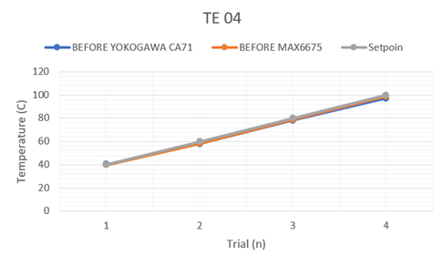
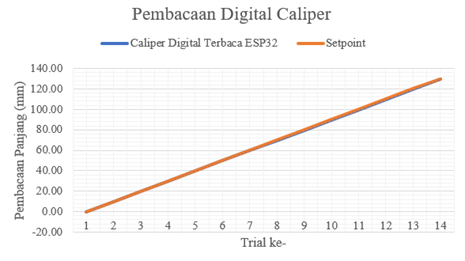
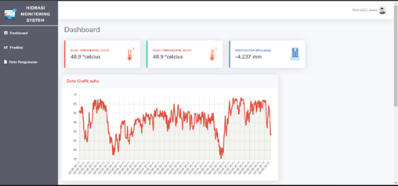
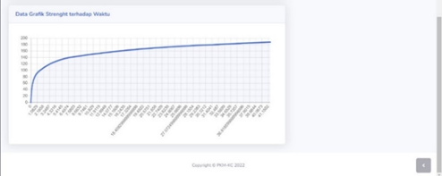
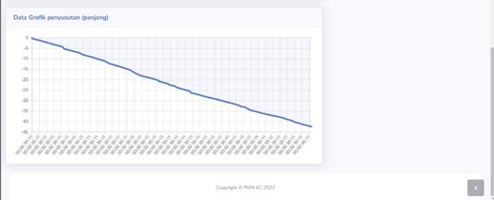

# Heat Hydration

## Latar Belakang

Perilaku struktur beton pada gedung sangat dipengaruhi oleh mutunya. Salah satu faktor internal beton yang dapat menurunkan kualitas mutu beton adalah panas hidrasi (Lu et al., 2020). Panas akibat proses hidrasi sulit dilepaskan oleh
beton karena sifat konduktivitas beton yang rendah sehingga terjadi perbedaan suhu antara beton dan lingkungan yang besar seiring peningkatan suhu hidrasi
(Gowripalan, 2020). Perbedaan suhu ini mengakibatkan peristiwa konveksi yang menimbulkan tegangan tarik pada sisi luar dan tegangan tekan di bagian tengah  beton. Tegangan ini disebut dengan tegangan thermal. Tegangan thermal yang tidak mampu diterima pada umur awal beton menyebabkan retak yang terjadi bersamaan dengan susut. Retakan dan susut mengubah sifat mekanik beton sehingga terjadi penurunan mutu beton (Gowripalan, 2020).
Mutu beton yang berubah penting untuk diketahui dengan cara evaluasi yang ditinjau dengan Indeks kematangan beton. Evaluasi ini didasari oleh hasil monitoring kenaikan suhu dan perubahan susut beton sebagai efek dari panas hidrasi sejak umur awal.
Monitoring kenaikan suhu dan perubahan susut merupakan hal yang penting diperhatikan dalam mengevaluasi mutu beton. Namun, sistem akuisisi yang digunakan untuk monitoring masih menggunakan transfer data dari data logger menuju komputer atau bahkan dicatat secara manual. Akuisisi data dengan sistem ini berisiko mudah mengalami kehilangan data record karena pada kondisi monitoring realtime terdapat banyak gangguan dan kurang praktis karena data tidak dapat dipantau secara jarak jauh serta memerlukan komputer yang harus menyala ketika monitoring, yang mana monitoring dilakukan selama 24 jam.
Inovasi yang diberikan untuk permasalahan tersebut adalah perancangan sistem monitoring dengan automasi transfer data ke cloud database sebagai wadah penyimpanan dan pengolahan data. Transfer data dari penyimpanan internal dapat dilakukan secara otomatis atau dikendalikan oleh pengguna saat terdapat jaringan internet. Data input yang telah ditransfer, diolah dalam pemrograman untuk mendapatkan maturity index berupa grafik yang akan dibandingkan antara data lab dan lapangan sebagai tinjauan evaluasi kematangan beton akibat efek panas hidrasi. Selain itu, perubahan susut dapat diklasifikasikan berdasarkan waktu yang berjalan dan kondisi kenaikan suhu. Adapun, Modifikasi pada instrumen susut yang menggunakan prinsip sinyal impuls pada kaliper digital yang bekerja bersamaan dengan pengukuran suhu oleh sensor thermocouple. Implementasi ide ini diharapkan dapat menjawab masalah tersebut  yang mana proses perwujudan ide akan dijelaskan dalam laporan ini.

## Rumusan Masalah

Masalah yang dapat dirumuskan dari latar belakang di atas adalah sebagai
berikut.

1. Merancang purwarupa dan algoritma sistem untuk mengukur parameter evaluasi mutu beton (suhu dan susut) pada umur awal akibat efek panas
hidrasi berbasis wireless?
2. Bagaimana cara kerja sistem akuisisi data sehingga dapat menjadi indikator evaluasi mutu beton pada umur awal akibat efek panas hidrasi?
3. Bagaimana menciptakan visualisasi dari sistem akuisisi data parameter evaluasi mutu beton pada umur awal akibat efek panas hidrasi berbasis wireless?

## Tujuan

Tujuan yang akan dicapai dari Program Kreativitas Mahasiswa ini adalah
sebagai berikut.
1. Merancang purwarupa dan algoritma sistem untuk mengukur parameter
evaluasi mutu beton (suhu dan susut) pada umur awal akibat efek panas
hidrasi berbasis wireless.
2. Mengetahui cara kerja sistem akuisisi data sehingga dapat menjadi
indikator evaluasi mutu beton pada umut awal akibat efek panas hidrasi.
3. Menciptakan visualisasi sistem akuisisi data parameter evaluasi mutu
beton pada umur awal akibat panas hidrasi berbasis wireless.

## Manfaat Program
Manfaat dari program Kreativitas Mahasiswa ini adalah sebagai berikut.

1. Bagi Pelaksana
Tercapainya peran dan fungsi mahasiswa untuk be eran pada masyarakat  dan bidang keilmuannya.

2. Bagi Akademisi
Menunjang riset terkait inovasi beton yang mengkaji panas hidrasi sebagai properties beton.

3. Bagi Industri Konstruksi
a. Mempermudah monitoring dan evaluasi mutu beton dengan sistem yang lebih akurat dan praktis.
b. Adanya riwayat pengujian pada penyimpanan awan akan membantu dalam pencarian problem pada sistem struktural pekerjaan konstruksi.

## Hasil pengujian dan evaluasi
Hasil dan evaluasi yang diperoleh dari pengujian alat meliputi: 

### Hasil pengambilan data thermocouple tipe K tersaji dalam grafik berikut

Gambar 4. 6 Kalibrasi Pengukuran Suhu
Error thermocouple terukur rata-rata sebesar 0.8025°C (absolute). Hal ini menandakan bahwa standar pengukuran <5% dari range 60°C sudah te enuhi atau bernilai < 3°C. 

### Hasil pengujian Panjang susut tersaji pada grafik berikut. 

Gambar 4. 7 Kalibrasi Pengukuran Susut
Error pengukuran digital caliper diperoleh sebesar 252.142857 µm. Nilai error ini masih jauh dari harapan, yakni sesuai standar 10 µm. ketidaksesuaian ini dimungkinkan terjadi karena kontak multiple elektrode stator (tembaga) dengan jalur slider (sin-cos plate) pada PCB terkadang bergeser vertical (normalnya hanya bergeser horizontal sepanjang tuas caliper) sehingga menyebabkan adanya gap antar plate dan timbul noise capacitance. Gap ini dimungkinkan terjadi karena pemasangan caliper dan kabel extender ke modul memakan jalur gerak tuas caliper sehingga jika dilihat dari sisi mekanikal akan sedikit menganga.

### Hasil percobaan monitoring dari sampel beton mutu 25 MPa yang dibuat memperoleh hasil sebagai berikut. 

Data hasil pengukuran suhu oleh termokopel disajikan pada gambar 4.8 dan data pengukuran susut oleh digital caliper disajikan oleh gambar 4.10. Untuk memperoleh prediksi kuat tekan beton digunakan nilai suhu yang dimasukkan kedalam persamaan Nurse-Saul dan diperoleh plot grafik perbandingan kuat tekan terhadap umur beton.

Gambar 4. 8 Hasil Monitoring Suhu Beton

Gambar 4. 9 Hasil Ploting Grafik Indeks Kematangan Beton

Gambar 4. 10 Hasil Monitoring Susut Beton

## Kesimpulan
Sistem yang kami buat merupakan sistem akuisisi data berbasis wireless untuk evaluasi efek panas hidrasi beton pada umur awal. Data hasil pengukuran dan monitoring parameter panas hidrasi akan dikirim pada penyimpanan cloud. Sehingga dapat diakses secara realtime melalui website. Adapun alat yang kami buat berhasil diimplementasikan pada sampel beton mutu 25 MPa. Akan tetapi, dari hasil evaluasi diperoleh nilai eror rata-rata pembacaan suhu sebesar 0.8025˚C dan eror pembacaan susut sebesar 0,25mm dibandingkan dengan alat yang terkalibrasi.

## Saran
Saran kami dalam mewujudkan pengembangan alat ini menuju arah yang lebih baik adalah mempertimbangkan sensor dengan ketelitian yang lebih baik atau lebih mendalami cara meningkatkan kualitas pengukuran. Selain itu, perlu adanya kerja sama dengan pihak lain agar pengembangkan alat mampu diimplementasikan di lapangan dan potensi khusus dapat tercapai.

## Dokumentasi PKM (Youtube Ditmawa ITS 2022)
Dokumentasi ada pada direktori Luaran PKM (Video dan Audio). 

Link youtube:
https://www.youtube.com/watch?v=sR6Rn05YM_g&ab_channel=DirektoratKemahasiswaanITS